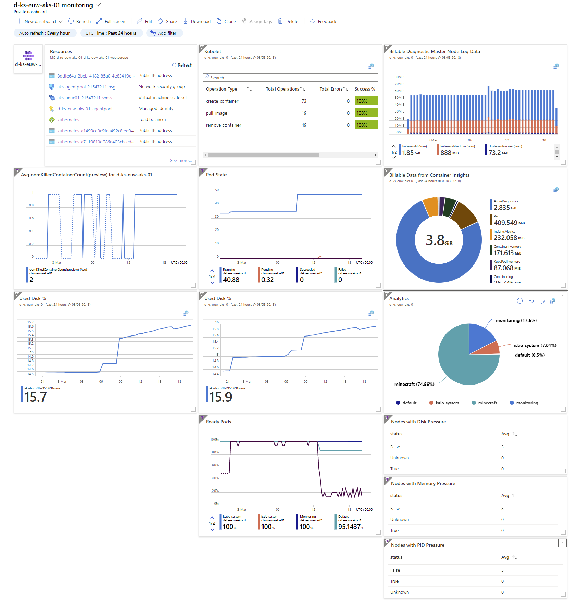

# Azure Dashboards

Here are some examples of Azure Dashboards to showcase the dynamic resource status reporting. These JSON files, which are resuable by dynamically bininding business names

`d-ks-euw-aks-01 monitoring.json`

`AKS Secure Baseline Cluster.json`

